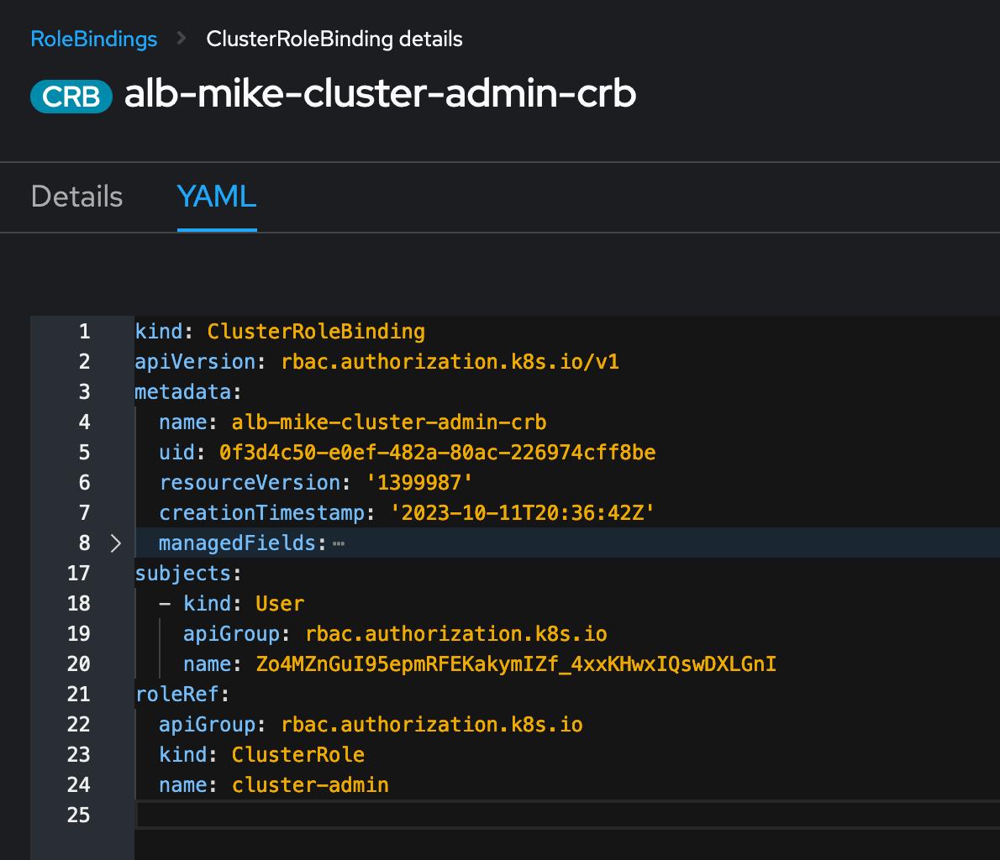

# Azure Lab Builders - Building an Azure Red Hat OpenShift Lab

## Various Links

- [Red Hat Cloud Experts](https://cloud.redhat.com/experts/)
- [Azure Front Door with ARO](https://cloud.redhat.com/experts/aro/frontdoor/)
- [Azure Arc with ARO](https://cloud.redhat.com/experts/aro/azure-arc-integration/)

## AAD Integration with ARO

- described in MSFT [docs](https://learn.microsoft.com/en-us/azure/openshift/configure-azure-ad-ui)
- make your user a cluster-admin through a ClusterRoleBinding
- you've done it correctly if you can login and see the administrator view (like you would as kubeadmin)

